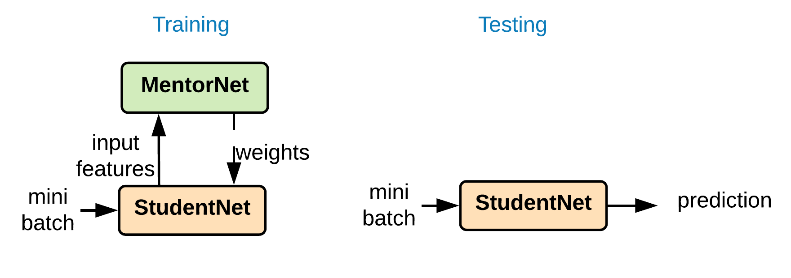
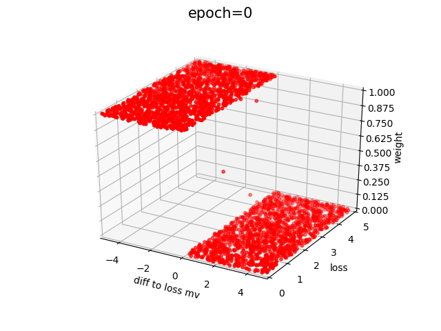
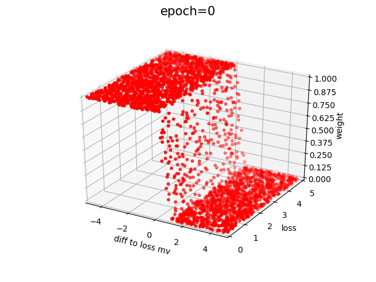
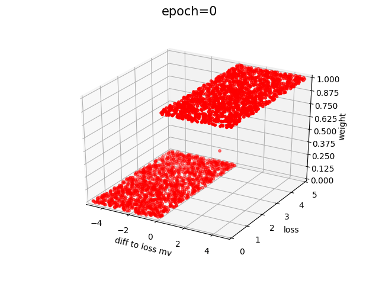
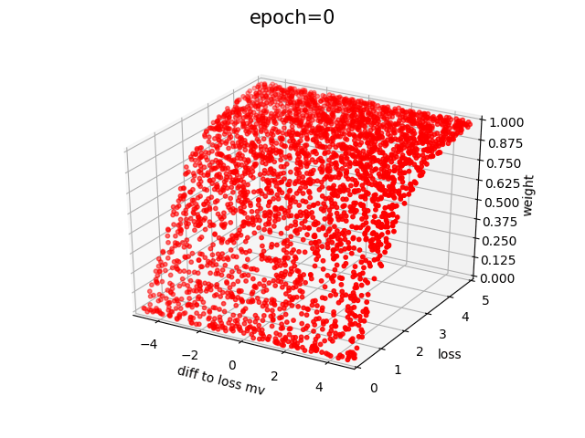
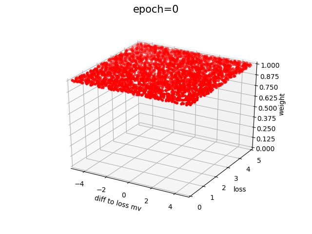
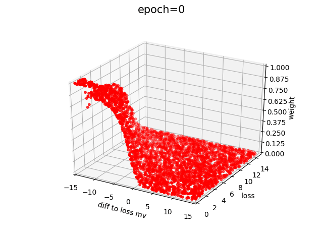
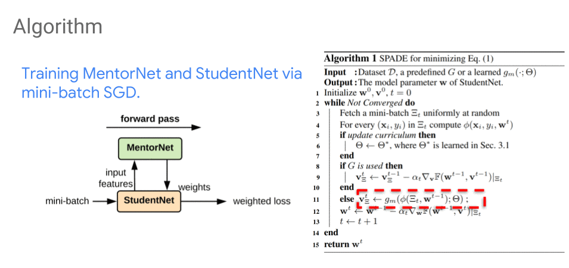

# MentorNet: Learning Data-Driven Curriculum for Very Deep Neural Networks

This is the code for the paper:

**<a href="https://arxiv.org/abs/1712.05055">MentorNet: Learning Data-Driven Curriculum for Very Deep Neural Networks on Corrupted Labels
</a>**
<br>
Lu Jiang, Zhengyuan Zhou, Thomas Leung, Li-Jia Li, Li Fei-Fei
<br>
Presented at [ICML 2018](https://icml.cc/Conferences/2018)


*Please note that this is not an officially supported Google product.*

If you find this code useful in your research then please cite

```
@inproceedings{jiang2018mentornet,
  title={MentorNet: Learning Data-Driven Curriculum for Very Deep Neural Networks on Corrupted Labels},
  author={Jiang, Lu and Zhou, Zhengyuan and Leung, Thomas and Li, Li-Jia and Fei-Fei, Li},
  booktitle={ICML},
  year={2018}
}
```


## Introduction

We are interested in training a deep network using curriculum learning (Bengio et al., 2009), i.e. learning examples with focus.
Each curriculum is implemented as a network (called **MentorNet**).

- During training, MentorNet supervises the training of the base network (called **StudentNet**).
- At the test time, StudentNet makes prediction alone without MentorNet.





## Setups

All code was developed and tested on Nvidia V100/P100 (16GB) the following environment.

- Ubuntu 18.04
- Python 2.7.15
- TensorFlow 1.8.0
- numpy 1.13.3
- imageio 2.3.0

Download [Cloud SDK](https://cloud.google.com/sdk/) to get data and models. Next we need to download the dataset and pre-trained MentorNet models. Put them into the same directory as the `code` directory. 

```bash
gsutil -m cp -r gs://mentornet_project/data .
gsutil -m cp -r gs://mentornet_project/mentornet_models .
```

Alternatively, you may download the zip files: [data](https://storage.cloud.google.com/mentornet_project/data.zip) and [models](https://storage.cloud.google.com/mentornet_project/mentornet_models.zip).


## Running MentorNet on CIFAR


```bash
export PYTHONPATH="$PYTHONPATH:$PWD/code/"

python code/cifar_train_mentornet.py \
  --dataset_name=cifar10   \
  --trained_mentornet_dir=mentornet_models/models/mentornet_pd1_g_1/mentornet_pd \
  --loss_p_precentile=0.75  \
  --nofixed_epoch_after_burn_in  \
  --burn_in_epoch=0  \
  --example_dropout_rates="0.5,17,0.05,83" \
  --data_dir=data/cifar10/0.2 \
  --train_log_dir=cifar_models/cifar10/resnet/0.2/mentornet_pd1_g_1/train \
  --studentnet=resnet101 \
  --max_number_of_steps=39000
```

A full list of commands can be found in this file.
The training script has a number of command-line flags that you can use to configure the model architecture, hyperparameters, and input / output settings:

- `--trained_mentornet_dir`: Directory where to find the trained MentorNet model, created by `mentornet_learning/train.py`.
- `--loss_p_percentile`: p-percentile used to compute the loss moving average. Default is `0.7`.
- `--burn_in_epoch`: Number of first epochs to perform burn-in. In the burn-in period, every sample has a fixed 1.0 weight. Default is `0`.
- `--fixed_epoch_after_burn_in`: Whether to use the fixed epoch as the MentorNet input feature after the burn-in period. Set True for MentorNet DD. Default is `False`.
- `--loss_moving_average_decay`: Decay factor used in moving average. Default is `0.5`.
- `--example_dropout_rates`: Comma-separated list indicating the example drop-out rate for the total of 100 epochs. The format is [dropout rate, epoch_num]+, the piecewise drop-out rate from boundaries and values. The sum of epoch_num is 100. Drop-out means the probability of setting sample weights to zeros proposed (Liang et al., 2016). Default is `0.5, 17, 0.05, 78, 1.0, 5`.

To evaluate a model, run the evaluation job in parallel with the training job (on a different GPU).

```bash
python cifar/cifar_eval.py \
 --dataset_name=cifar10 \
 --data_dir=cifar/data/cifar10/val/ \
 --checkpoint_dir=cifar_models/cifar10/resnet/0.2/mentornet_pd1_g_1/train \
 --eval_dir=cifar_models/cifar10/resnet/0.2/mentornet_pd1_g_1//eval_val \
 --studentnet=resnet101 \
 --device_id=1
```

A complete list of commands of running experiments can be found at `commands/train_studentnet_resnet.sh` and `commands/train_studentnet_inception.sh`.

## MentorNet Framework

MentorNet is a **general** framework for curriculum learning, where various curriculums can be learned by the same MentorNet structure of different parameters.

It is **flexible** as we can switch curriculums by attaching different MentorNets without modifying the pipeline.

We train a few MentorNets listed below. We can think of a MentorNet as a hyper-parameter and will be tuned for different problems.


| Curriculum                            |                                           Visualization                                              |                   Intuition                      |       Model Name      |
| :-------------------------------------| :----------------------------------------------------------------------------------------------------| :------------------------------------------------| :-------------------- |
| No curriculum         |       |  Assign uniform weight to every sample uniform.                        |`baseline_mentornet` |
| Self-paced <br/>(Kuma et al. 2010)         |      |  Favor samples of smaller loss.                        |`self_paced_mentornet` |
| SPCL linear <br/>(Jiang et al. 2015)       |       |  Discount the weight by loss linearly.                 |`spcl_linear_mentornet`|
| Hard example mining <br/>(Felzenszwalb et al., 2008) |  | Favor samples of greater loss.         | `hard_example_mining_mentornet` |
| Focal loss <br/>(Lin et al., 2017)         |       |  Increase the weight by loss by the exponential CDF.        | `focal_loss_mentornet`|
| Predefined Mixture         |   |  Mixture of SPL and SPCL changing by epoch.       |   `mentornet_pd`       |
| MentorNet Data-driven     |    | Learned on a small subset of the CIFAR data.  | `mentornet_dd`         |


Note there are many more curriculums can be trained by MentorNet, for example,
prediction variance (Chang et al., 2017), implicit regularizer (Fan et al. 2017), self-paced with diversity (Jiang et al. 2014),
sample re-weighting (Dehghani et al., 2018, Ren et al., 2018), etc.


### Performance

*The numbers are slightly different from the ones reported in the paper due to
the re-implementation on the third party library.*


**CIFAR-10 ResNet**

| noise_fraction| baseline | self_paced | focal_loss | mentornet_pd| mentornet_dd |
| ----------: | -------: | ---------: | ---------: | ---------: | -----------: |
| 0.2         | 0.796    | 0.822      | 0.797      | 0.910       | **0.914**        |
| 0.4         | 0.568    | 0.802      | 0.634      | 0.776      | **0.887**        |
| 0.8         | 0.238    | 0.297      | 0.25       | 0.283      | **0.463**        |

**CIFAR-100 ResNet**

| noise_fraction| baseline | self_paced | focal_loss | mentornet_pd| mentornet_dd |
| ----------: | -------: | ---------: | ---------: | ---------: | -----------: |
| 0.2         | 0.624    | 0.652      | 0.613      | **0.733**      | 0.726        |
| 0.4         | 0.448    | 0.509      | 0.467      | 0.567      | **0.675**        |
| 0.8         | 0.084    | 0.089      | 0.079      | 0.193      | **0.301**        |

**CIFAR-10 Inception**

| noise_fraction| baseline | self_paced | focal_loss | mentornet_pd | mentornet_dd|
| ----------: | -------: | ---------: | ---------: | -----------: | ---------: |
| 0.2         | 0.775    | 0.784      | 0.747      | 0.798        | **0.800**        |
| 0.4         | 0.72     | 0.733      | 0.695      | 0.731        | **0.763**      |
| 0.8         | 0.29     | 0.272      | 0.309      | 0.312        | **0.461**      |

**CIFAR-100 Inception**

| noise_fraction| baseline | self_paced | focal_loss | mentornet_pd | mentornet_dd|
| ----------: | -------: | ---------: | ---------: | -----------: | ---------: |
| 0.2         | 0.42     | 0.408      | 0.391      | 0.451        | **0.466**      |
| 0.4         | 0.346    | 0.32       | 0.313      | 0.386        | **0.411**      |
| 0.8         | 0.108    | 0.091      | 0.107      | 0.125        | **0.203**      |


### Algorithm

We propose an algorithm to optimize the StudentNet model parameter w jointly with a

given MentorNet. Unlike the alternating minimization, it minimizes w (StudentNet parameter) and v (sample weight) **stochastically over mini-batches**.

The curriculum can change during training, and MentorNet is updated a few times in the algorithm.




To learn new curriculums (Step 6), see [this page](TRAINING.md).

*We found specific MentorNet architectures do not matter that much.*


## References
- Bengio, Yoshua, et al. "Curriculum learning". In ICML, 2009.
- Kumar M. Pawan, Packer Benjamin, and Koller Daphne "Self-paced learning for latent variable models". In NIPS, 2010.
- Jiang, Lu et al. "Self-paced Learning with Diversity", In NIPS 2014
- Jiang, Lu, et al. "Self-Paced Curriculum Learning." In AAAI. 2015.
- Liang, Junwei et al. Learning to Detect Concepts from Webly-Labeled Video Data, In IJCAI  2016.
- Lin, Tsung-Yi, et al. "Focal loss for dense object detection." In ICCV. 2017.
- Fan, Yanbo, et al. "Self-Paced Learning: an Implicit Regularization Perspective." In AAAI 2017.
- Felzenszwalb, Pedro, et al. "A discriminatively trained, multiscale, deformable part model." In CVPR 2008.
- Dehghani, Mostafa, et al. "Fidelity-Weighted Learning." In ICLR 2018.
- Ren, Mengye, et al. "Learning to reweight examples for robust deep learning." In ICML 2018.
- Fan, Yang, et al. "Learning to Teach." In ICLR 2018.
- Chang, Haw-Shiuan, et al. "Active Bias: Training More Accurate Neural Networks by Emphasizing High Variance Samples." In NIPS 2017.

