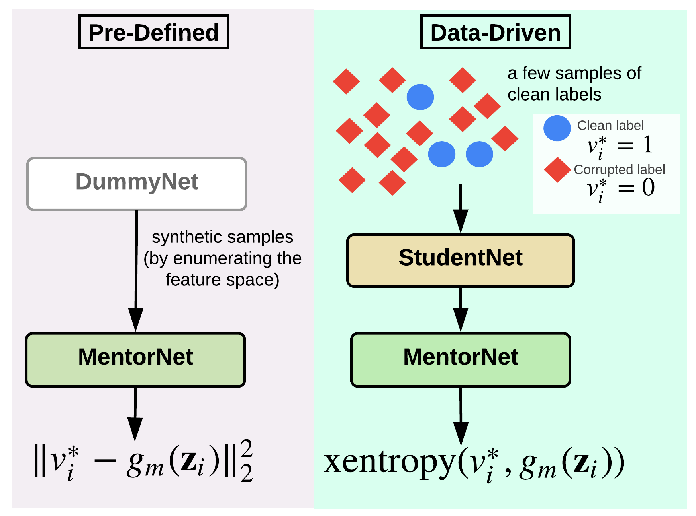

# Learning New MentorNet

There are two ways to learn a MentorNet.

- **Pre-Defined**: learn to approximate existing curriculums
- **Data-Driven**: learn new curriculums on a small set (~10%) of clean labels.

Sometimes, when the clean data is not available, we learn a data-driven MentorNet on another dataset (with clean labels) and transfer it on the target dataset.
*In experiments, we learn the MentorNet on CIFAR-10 and use it on CIFAR-100.*.




## Step 1 Generate Data

### Pre-Defined Curriculums

Define the vstar function and

```python
def vstar_mentornet_pd(inbatch, **kwargs):
  # New implementation here
  v = np.maximum(np.minimum(v, 1), 0)
  return v
```

Generate the synthetic training/test data by enumerating the input feature space.

```bash
python code/training_mentornet/data_generator.py \
  --outdir=mentornet_models/data/mentornet_pd_example \
  --vstar_fn=vstar_mentornet_pd \
  --vstar_gamma=1 \
  --sample_size=100000
```

### Data-Driven Curriculums

Dump the StudentNet feature into a csv of the following format.

| sample_id | epoch (0-99) | noisy label | clean label | loss      |
|-----------|:------------:|-------------|-------------|-----------|
| 262       | 18           | 9           | 9           | 0.003101  |
| 47108     | 18           | 6           | 1           | 19.554157 |

See `mentornet_models/studentnet_dump_csv/` for some examples.


```bash
python code/training_mentornet/data_generator.py \
  --vstar_fn=data_driven \
  --input_csv_filename=mentornet_models/studentnet_dump_csv/nl_0.2_datapara_0.75_7k.csv \
  --outdir=mentornet_models/data/mentornet_dd_example
```

## Step 2 Training

Train a MentorNet on the generated training set.

```bash
# Pre-Defined
python code/training_mentornet/train.py \
  --train_dir=mentornet_models/models/mentornet_pd_example \
  --data_path=mentornet_models/data/mentornet_pd_example \
  --max_step_train=3e4 \
  --learning_rate=0.1

# Data-Driven
python code/training_mentornet/train.py \
  --train_dir=mentornet_models/models/mentornet_dd_example \
  --data_path=mentornet_models/data/mentornet_dd_example/nl_0.2_datapara_0.75_7k_percentile_90 \
  --max_step_train=3e4 \
  --learning_rate=0.1
```


## Step 3 Visualize (optional)

Use the following commands to visualize curriculums learned by MentorNet.

```bash
python code/training_mentornet/visualizer.py \
  --model_dir=mentornet_models/models/mentornet_pd_example \
  --epoch_ranges="0,10,18,20,30,40,50,60,70,80,90,95,99" \
  --loss_bound=5

python code/training_mentornet/visualizer.py \
  --model_dir=mentornet_models/models/mentornet_dd_example \
  --epoch_ranges="0,10,18,20,30,40,50,60,70,80,90,95,99" \
  --loss_bound=15
```

The commands can be found at `commands/training_mentornet_command.sh`.
